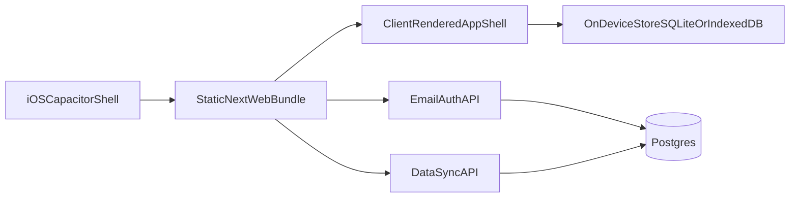

# Next.js to iOS (SPA-First Static) Migration Plan

## Purpose & Logic

The app is entirely behind authentication, so SEO/SSR benefits are low priority for core product screens. To reduce complexity and unblock Capacitor delivery, the best path is to convert authenticated UX paths to SPA-style client rendering with static export compatibility, while keeping backend APIs/auth endpoints as remote services. This removes server-rendering constraints from mobile-targeted screens and simplifies build/runtime boundaries.

## Current Constraints (Why Refactor Is Needed)

- Server-backed API routes are core to app behavior in [`/Users/fivaz/code/fit/app/api`](/Users/fivaz/code/fit/app/api).
- Server-only auth/session flow depends on request headers/cookies in [`/Users/fivaz/code/fit/lib/api/server.ts`](/Users/fivaz/code/fit/lib/api/server.ts) and [`/Users/fivaz/code/fit/lib/auth.ts`](/Users/fivaz/code/fit/lib/auth.ts).
- DB and business logic live server-side with Prisma in [`/Users/fivaz/code/fit/lib/prisma/index.ts`](/Users/fivaz/code/fit/lib/prisma/index.ts) and [`/Users/fivaz/code/fit/prisma/schema.prisma`](/Users/fivaz/code/fit/prisma/schema.prisma).
- App assumes Next server runtime (no static export setup) in [`/Users/fivaz/code/fit/next.config.ts`](/Users/fivaz/code/fit/next.config.ts) and scripts in [`/Users/fivaz/code/fit/package.json`](/Users/fivaz/code/fit/package.json).

## Target Architecture

## Execution Plan (Phased)

### Phase 0 - Confirm SPA Product Boundaries (1-2 days)

- Freeze first iOS scope to email/password auth and core tracking features (workouts, exercises, body metrics).
- Confirm authenticated pages are allowed to move to client-rendered SPA behavior.
- Mark non-v1 features that can remain server-only temporarily.
- Produce capability matrix: online-required vs offline-capable vs deferred.

### Phase 1 - Decouple Domain From Next Route Handlers (3-5 days)

- Extract pure domain/service interfaces for data operations currently reached through Next route handlers.
- Keep existing server behavior stable while introducing adapter boundaries.
- Likely touchpoints:
  - [`/Users/fivaz/code/fit/lib/workout`](/Users/fivaz/code/fit/lib/workout)
  - [`/Users/fivaz/code/fit/lib/exercise`](/Users/fivaz/code/fit/lib/exercise)
  - [`/Users/fivaz/code/fit/lib/program`](/Users/fivaz/code/fit/lib/program)
  - [`/Users/fivaz/code/fit/lib/body-metrics`](/Users/fivaz/code/fit/lib/body-metrics)

### Phase 2 - Introduce Mobile Data Layer + Offline Store (5-8 days)

- Add a client data repository layer that can switch between:
  - local offline storage (primary for iOS app)
  - remote sync endpoints (when online)
- Implement conflict strategy (last-write-wins initially, with timestamps + entity version fields).
- Migrate current client API callers from direct `/api/*` assumptions to repository abstraction:
  - [`/Users/fivaz/code/fit/lib/api-client.ts`](/Users/fivaz/code/fit/lib/api-client.ts)
  - [`/Users/fivaz/code/fit/lib/workout/api.ts`](/Users/fivaz/code/fit/lib/workout/api.ts)
  - [`/Users/fivaz/code/fit/lib/exercise/api.ts`](/Users/fivaz/code/fit/lib/exercise/api.ts)
  - [`/Users/fivaz/code/fit/lib/program/api.ts`](/Users/fivaz/code/fit/lib/program/api.ts)
  - [`/Users/fivaz/code/fit/lib/body-metrics/api.ts`](/Users/fivaz/code/fit/lib/body-metrics/api.ts)

### Phase 3 - Replace Session-Cookie Auth For SPA/Mobile Flow (3-5 days)

- Shift app-facing auth to token/session behavior compatible with client-rendered SPA routes and native webview startup.
- Implement email/password-only mobile login path (as requested).
- Ensure secure token persistence and refresh strategy.
- Adjust auth dependencies now tied to server headers/cookies:
  - [`/Users/fivaz/code/fit/lib/utils-server.ts`](/Users/fivaz/code/fit/lib/utils-server.ts)
  - [`/Users/fivaz/code/fit/proxy.ts`](/Users/fivaz/code/fit/proxy.ts)
  - [`/Users/fivaz/code/fit/app/api/auth/[...all]/route.ts`](/Users/fivaz/code/fit/app/api/auth/[...all]/route.ts)

### Phase 4 - SPA Route Conversion + Static Build Strategy (4-7 days)

- Convert authenticated `app/**/page.tsx` flows to client-rendered SPA behavior where they still rely on server-only APIs (`headers`, cookies, runtime-only assumptions).
- Ensure dynamic route screens used in iOS have static-export-safe routing behavior (no SSR-required data fetch at render time).
- Remove or isolate server-only route groups from the static iOS bundle build.
- Introduce explicit env sets for:
  - web server deployment
  - iOS static bundle + sync/auth endpoints
- Update scripts/docs:
  - [`/Users/fivaz/code/fit/package.json`](/Users/fivaz/code/fit/package.json)
  - [`/Users/fivaz/code/fit/.env.example`](/Users/fivaz/code/fit/.env.example)
  - [`/Users/fivaz/code/fit/README.md`](/Users/fivaz/code/fit/README.md)

### Phase 5 - Capacitor Integration (2-4 days)

- Add Capacitor dependencies/config and iOS platform project.
- Point Capacitor to static web output directory.
- Add native plugins needed by app behavior (network status, keyboard, optional splash/status bar).
- Define build chain: `spa static build -> capacitor copy/sync -> Xcode archive`.

### Phase 6 - iOS Hardening + QA (4-6 days)

- Validate lifecycle-sensitive features in WKWebView (timers, focus events, background/foreground resume).
- Validate upload flows and permissions.
- Verify offline-first behavior and sync recovery on flaky networks.
- Add smoke tests for auth, create/edit/delete data, and sync conflict handling.

### Phase 7 - App Store Readiness (2-3 days)

- Add privacy usage descriptions and data collection disclosures.
- Prepare App Transport Security and networking policy checks.
- Create release checklist: versioning, screenshots, TestFlight rollout, rollback plan.

## Deliverables Per Milestone

- M1: Domain/repository abstraction merged with no web regressions.
- M2: Offline local storage powering iOS-targeted flows.
- M3: Email/password SPA/mobile auth path complete.
- M4: Authenticated routes converted to static-export-safe SPA behavior for iOS bundle.
- M5: iOS app builds/runs from Xcode and passes QA checklist.

## Risks & Mitigations

- SPA migration regression risk: convert screen-by-screen with smoke tests on auth, programs, workouts, and body metrics.
- Auth complexity risk: isolate mobile auth path first; defer social providers.
- Data sync risk: start with deterministic conflict policy + server audit logs.
- Timeline risk: ship limited v1 feature set before parity work.

## Validation Checklist (What you can approve now)

- Refactor-first strategy over quick webview wrapper.
- SPA-first conversion for authenticated product screens to reduce SSR/static export friction.
- Email/password-only iOS v1 auth.
- Incremental migration that keeps backend APIs running while frontend shifts to SPA-compatible rendering.
- Offline-first local data model with explicit sync phase.
